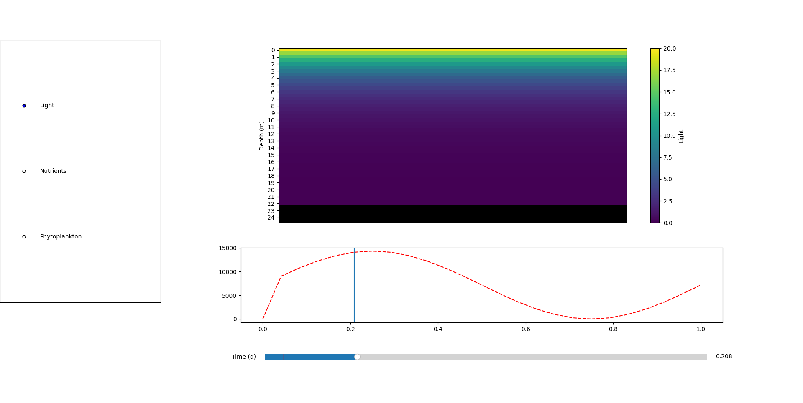

# Physical-biological model of an estuarine ecosystem in python.

This model is made of a grid of cells, and updates each of the cells for every time-step to represent the evolution of different variables (eg. light, nutrients, phytoplankton etc.).
Each cell has a value for all of the variables of the model, and can update these values based its position and the values at time = t - 1.

For instance, here is the visualization of light availability in the estuary : light is maximal at the surface then decreases exponentially with depth. 
On the bottom, you can see total light in the system relative to time. This is a simple day/night cycle with a $sin$ wave. Note that the cross-section above only shows the model state at time = t.

All of the equations used in the model are located in tools/equations.py. To run the model, run the file estuarine_model.py.

For now, the model only simulates a 2d cross-section of the river, but we can add the third dimension later.

**To-do list** :
- [x] Basic cell framework that allows for different variables and equations
- [x] Simple visualization option
- [x] Advection-diffusion
- [x] Water current as a vector field
- [ ] Continuity equation (mass conservation)
- [ ] NPZD dynamics, turbidity, light availability
- [ ] Integrate the benthic compartment
- [ ] Different water masses and stratification
- [ ] Tides and changing water level (tough)
- [ ] Go 3d
- [ ] Optimization ?

**Useful resources** :
- <https://drzgan.github.io/Python_CFD/2.1D%20linear%20convection.html>
- <https://scipython.com/books/book2/chapter-7-matplotlib/examples/the-two-dimensional-diffusion-equation/>